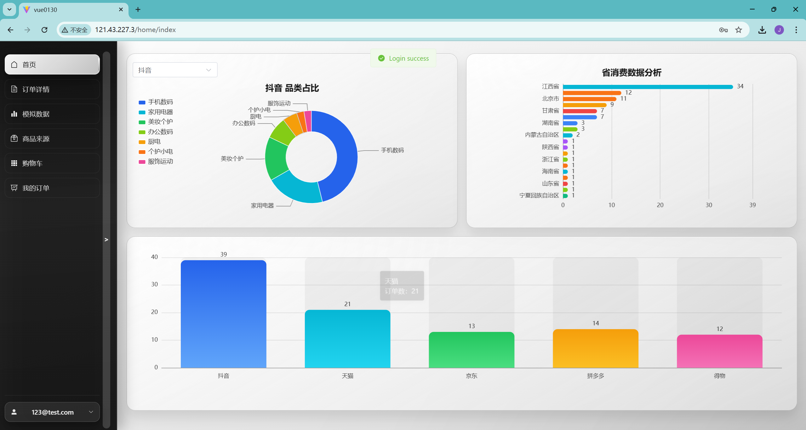
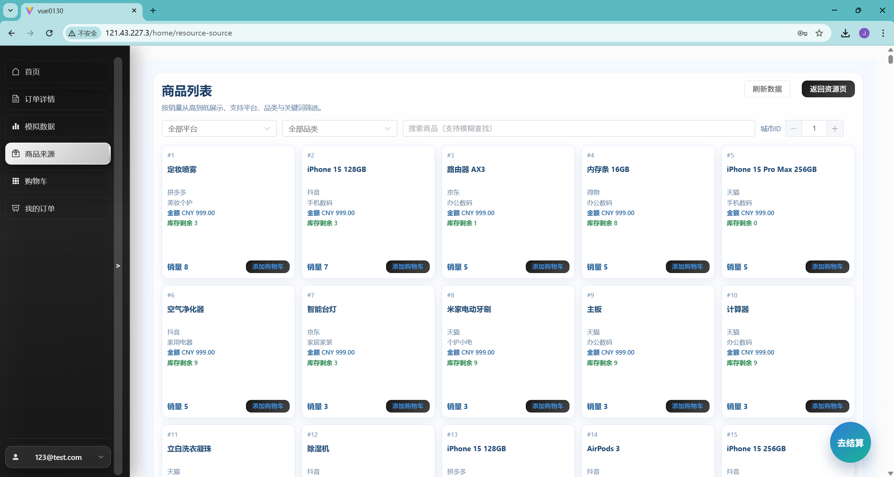

# ConsumeAnalyseSystem

基于 `Spring Boot + Vue 3 + ECharts` 的消费分析系统，后端负责业务接口与数据处理，前端负责数据可视化展示。

## 项目结构

- `src/`：Spring Boot 后端代码
- `vue0130/`：Vue 3 前端代码（Vite）
- `model.sql`：数据库初始化脚本

## 技术栈与版本

### 本地开发环境（当前机器）

| 工具 | 版本 |
| --- | --- |
| JDK | `21.0.5` |
| Maven | `3.9.11` |
| Node.js | `24.8.0` |
| npm | `11.6.0` |

### 后端（`pom.xml`）

| 组件 | 版本 |
| --- | --- |
| Spring Boot | `3.5.9` |
| Java | `21` |
| RocketMQ Spring Boot Starter | `2.3.5` |
| MyBatis Spring Boot Starter | `3.0.3` |
| Java JWT (`com.auth0:java-jwt`) | `4.4.0` |
| MySQL 驱动 | 由 Spring Boot 版本管理 |

### 前端（`vue0130/package.json`）

| 组件 | 版本（package.json） |
| --- | --- |
| Vue | `^3.5.24` |
| Vite | `^7.2.4` |
| TypeScript | `~5.9.3` |
| ECharts | `^6.0.0` |
| Element Plus | `^2.13.1` |
| Axios | `^1.13.2` |
| Vue Router | `^4.6.4` |

说明：前端依赖使用了语义化版本范围，实际安装版本以 `vue0130/package-lock.json` 为准。

## 运行前准备

1. 导入数据库脚本：`model.sql`
2. 准备并启动依赖服务：
   - MySQL（默认 `3306`）
   - Redis（默认 `6379`）
   - RocketMQ NameServer（默认 `9876`）
3. 按需配置环境变量（后端 `application.yml` 已支持默认值/环境变量覆盖）

## 后端配置（环境变量）

常用配置项（见 `src/main/resources/application.yml`）：

- `MYSQL_HOST` / `MYSQL_PORT` / `MYSQL_DB` / `MYSQL_USER` / `MYSQL_PASSWORD`
- `REDIS_HOST` / `REDIS_PORT` / `REDIS_PASSWORD`
- `ROCKETMQ_NAMESRV` / `ROCKETMQ_PRODUCER_GROUP`
- `MAIL_HOST` / `MAIL_USERNAME` / `MAIL_PASSWORD`
- `ORDER_PAYMENT_TIMEOUT_SECONDS` / `ORDER_CLOSE_SCAN_MS`

## 启动方式

### 启动后端（Spring Boot）

```bash
mvn spring-boot:run
```

后端默认端口：`8080`

### 启动前端（Vue + Vite）

```bash
cd vue0130
npm install
npm run dev
```

前端默认端口通常为：`5173`

## 前端生产环境接口地址

可在 `vue0130/.env.production.example` 中配置：

```env
VITE_API_BASE_URL=
```

为空时默认使用同源请求（推荐通过 Nginx 反向代理转发后端接口）。

## 构建

### 后端打包

```bash
mvn clean package
```

### 前端打包

```bash
cd vue0130
npm run build
```

## 说明

- 当前仓库同时包含后端与前端源码。
- 如需部署到服务器，建议使用环境变量覆盖本地默认配置，避免将敏感信息写入仓库。

## 项目展示

登录页面：默认账户中的初始密码不可用，需要先自行注册用户并设置密码。


数据展示页面：前端通过 SSE 实时请求/展示新数据，后端进行实时推送。



购物车页面：当前版本暂未实现库存增加功能（待后续补充）。




